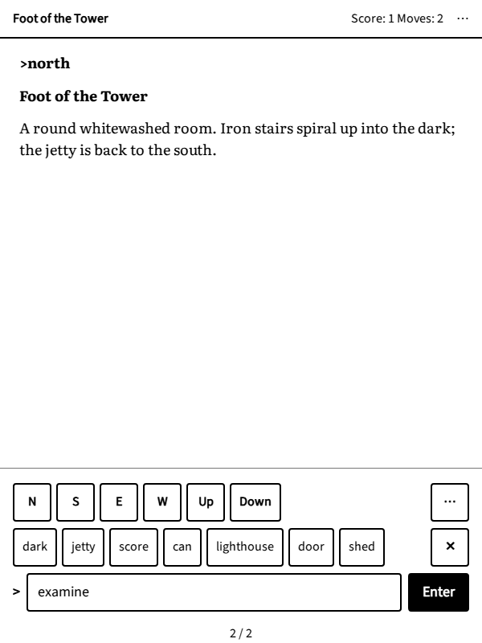
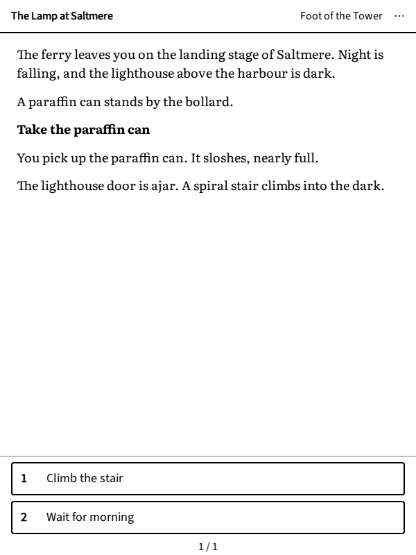

# How to play

## Commands

In a parser game, you tell the game what to do with a short command that starts with a verb, often followed by
an object: `take the lamp`, `open door`, `read letter`. Articles are optional and capitals do not matter. When the
game does not understand, it says so: try another word, simpler is usually better.

Commands you will use in almost every game:

- `look` (or `l`): describes where you are again.
- `examine lamp` (or `x lamp`): looks closely at something. Examine everything: details matter.
- `take key`, `drop key`, `inventory` (or `i`, the list of what you carry).
- `open door`, `close door`, `push button`, `pull lever`, `turn on lamp`, `wear coat`, `eat apple`.
- `put key in box`, `give coin to sailor`, `unlock door with key`.
- `talk to the keeper`, or `ask keeper about storm` and `tell keeper about ship`.
- `wait` (or `z`), `again` (or `g`, to repeat the last command).

## The compass

To move, you go in a direction: `north`, `south`, `east`, `west`, the diagonals `northeast` to `southwest`, and
`up`, `down`, `in`, `out`. One letter is enough for the main ones: `n`, `s`, `e`, `w`, `u`, `d`, and `ne`, `nw`,
`se`, `sw`. Room descriptions say where the exits are ("the jetty is back to the south"). Many players draw a map on
paper as they go: it helps more than you would think.

## When you are stuck

- Read the room description again, and examine what it mentions.
- Try `hint`, `help` or `about`: many games have built-in hints or instructions.
- Think about what a real person would do with what you carry.
- Take a break. The answer often comes later, away from the screen.

## Choice-based games

There is nothing to type: read the passage, then tap one of the choices under it. Some choices come back later,
others close a door for good; that is part of the story.

## Saving

Inkventure saves your game after every turn, on the e-reader itself: close the browser, let the e-reader sleep, and
you will find the game where you left it. You can also:

- **Undo** your last move, if it went badly;
- **Save** the game in one of five slots, before a risky moment, and **Restore** it later;
- **Restart** the story from the beginning (your saved games are kept).

All four are in the reader's menu (see the next chapter). The game's own `save` and `restore` commands are not used:
saves go through that menu.

## Playing with buttons

You rarely need the keyboard. Under the text, on the last page, Inkventure shows a row of directions, a row of
common actions and a command field:

{.screenshot}

- Tap **N**, **S**, **E**, **W**, **Up** or **Down** to walk; **⋯** has the other directions.
- Tap **Look** or **Inventory** to send them at once. **Examine…** and **Take…** wait for an object: the row then
  shows the things the story has just mentioned; tap one to send the command, or **✕** to cancel.
- **More…** has other actions (drop, open, talk to, wait, again, undo) and the commands you sent earlier.
- Tap a word in the story to put it in the command field.
- Or type the command in the field and tap **Enter**.

The buttons speak the game's language: an English game gets English buttons, a French game French ones.

In a choice-based game, the choices take the place of the buttons:

{.screenshot}
