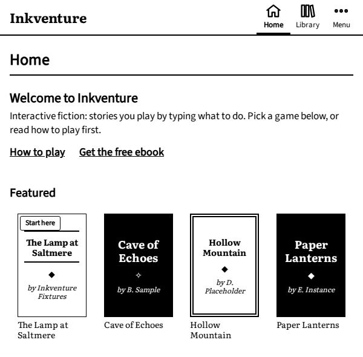
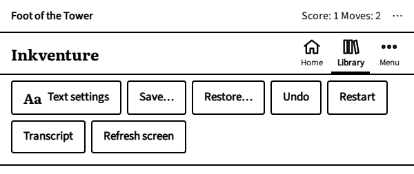
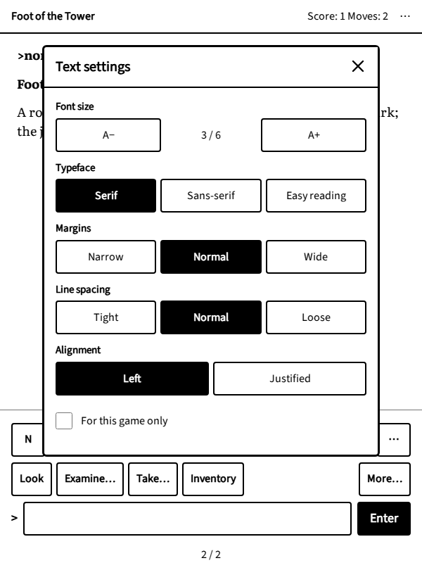

# Inkventure on your e-reader

## Opening the app

1. Turn on the Wi-Fi.
2. Open the web browser. On some e-readers it is in the main menu, sometimes under "experimental" features.
3. Go to <{{host}}>. Add it to the browser's bookmarks to find it again in one tap.

The links in this book do the same: follow one, confirm that you want to open the web page, and the app opens on that
game. On a device without a browser, or to send a game to a friend, scan the card's QR code with a phone.

The Wi-Fi is needed to open the app and to download a game. Once a game is open, it keeps working even if the
connection drops.

## Finding a game

The app opens on **Home**: the game you are playing, with a **Continue** button, your adventures, and a selection of
games to start with.

{.screenshot}

The **Library** has the whole catalogue: search by title or author, and narrow the list with **Filters** (genre,
language, length, rating…). The **Start here** filter and badge mark games that are kind to beginners. Tap a game
to see its page: a description, its length and rating, a **Play** button, and **Add to Home** to keep it for later.
Games come in many languages; a few have a file in each, and their page lets you choose.

## In the reader

The story is laid out in pages, like a book. Tap the right side of the screen to turn the page, the left side to go
back. The numbers at the bottom ("2 / 3") tell you which page you are on. The buttons and the command field are on
the last page, with the latest reply; from an earlier page, **Back to the present** takes you there.

Tap the line at the top of the page (the place where you are, the score) to open the menu:

{.screenshot}

- **Home** and **Library**, to leave the game (it is saved).
- **Aa Text settings**: text size, typeface (including *Easy reading*, with wider spacing), margins, line spacing
  and alignment, for every game or for this one only.
- **Save…**, **Restore…**, **Undo**, **Restart**.
- **Transcript**: everything that happened since you started, to read again.
- **Refresh screen**: e-ink screens keep a faint trace of earlier pages; this redraws the page cleanly.

{.screenshot}

## Where your games are kept

Your progress, saved games and settings are kept in the e-reader's web browser, on the device itself. There is no
account: nothing is sent anywhere, and nobody else can see what you play.

This has two consequences:

- Your games stay on this e-reader. On another device, you start again.
- Clearing the browser's data (cookies, site data or history, depending on the e-reader) erases them, as does
  **Reset all data** in the app's Settings.

The browser gives the app a few megabytes. **Settings › Data and storage** shows how much is used. When space runs
short, the app forgets downloaded game files first (they are downloaded again when needed), then old automatic saves
of games not played for months. It never deletes a game you saved yourself without telling you.
