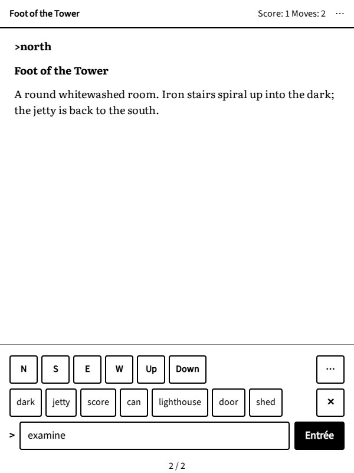

# Comment jouer

## Les commandes

Dans un jeu à analyseur, vous dites au jeu quoi faire par une courte commande qui commence par un verbe, souvent
suivi d'un objet : `prendre la lampe`, `ouvrir porte`, `lire lettre`. Les articles sont facultatifs et les
majuscules n'ont pas d'importance. Quand le jeu ne comprend pas, il le dit : essayez un autre mot, le plus simple est
souvent le meilleur.

Les commandes qui servent dans presque tous les jeux :

- `regarder` (ou `r`) : décrit de nouveau le lieu où vous êtes.
- `examiner lampe` (ou `x lampe`) : observe quelque chose de près. Examinez tout : les détails comptent.
- `prendre clé`, `poser clé`, `inventaire` (ou `i`, la liste de ce que vous portez).
- `ouvrir porte`, `fermer porte`, `pousser bouton`, `tirer levier`, `allumer lampe`, `mettre manteau`,
  `manger pomme`.
- `mettre clé dans boîte`, `donner pièce au marin`, `déverrouiller porte avec clé`.
- `parler au gardien`, ou `interroger gardien sur tempête`.
- `attendre` (ou `z`), `encore` (ou `g`, pour répéter la dernière commande).

Les jeux en anglais attendent des commandes en anglais : `look`, `examine lamp`, `take key`, `inventory`,
`open door`, `talk to the keeper`, `ask keeper about storm`, `wait`, `again`.

## La boussole

Pour vous déplacer, allez dans une direction : `nord`, `sud`, `est`, `ouest`, les diagonales `nord-est` à
`sud-ouest`, ainsi que `monter`, `descendre`, `entrer`, `sortir`. Une ou deux lettres suffisent pour les
principales : `n`, `s`, `e`, `o`, `ne`, `no`, `se`, `so`. En anglais : `north`, `south`, `east`, `west`, `up`,
`down`, `in`, `out`, ou `n`, `s`, `e`, `w`, `u`, `d`. Les descriptions des lieux indiquent les sorties (« la jetée
est au sud »). Beaucoup de joueurs dessinent un plan sur papier en avançant : cela aide plus qu'on ne le croit.

## Quand vous êtes bloqué

- Relisez la description du lieu, et examinez ce qu'elle mentionne.
- Essayez `aide`, `indice` (ou `help`, `hint`, `about` en anglais) : beaucoup de jeux ont des indices ou des
  instructions.
- Demandez-vous ce que ferait une vraie personne avec ce que vous portez.
- Faites une pause. La réponse vient souvent plus tard, loin de l'écran.

## Les jeux à choix

Rien à taper : lisez le passage, puis touchez l'un des choix proposés en dessous. Certains choix reviennent plus
tard, d'autres ferment une porte pour de bon ; cela fait partie de l'histoire.

## Les sauvegardes

Inkventure sauvegarde votre partie à chaque tour, sur la liseuse même : fermez le navigateur, laissez la liseuse se
mettre en veille, vous retrouverez la partie là où vous l'avez laissée. Vous pouvez aussi :

- **annuler** votre dernier tour, s'il a mal tourné ;
- **enregistrer** la partie dans l'un des cinq emplacements, avant un moment risqué, et la **charger** plus tard ;
- **recommencer** l'histoire depuis le début (vos parties enregistrées sont conservées).

Tout cela se trouve dans le menu du lecteur (voir le chapitre suivant). Les commandes `sauver` et `charger` du jeu
lui-même ne servent pas : les sauvegardes passent par ce menu.

## Jouer avec les boutons

Le clavier sert rarement. Sous le texte, sur la dernière page, Inkventure affiche une rangée de directions, une
rangée d'actions courantes et un champ de commande :

{.screenshot}

- Touchez **N**, **S**, **E**, **O**, **Haut** ou **Bas** pour marcher ; **⋯** propose les autres directions.
- Touchez **Regarder** ou **Inventaire** pour les envoyer aussitôt. **Examiner…** et **Prendre…** attendent un
  objet : la rangée montre alors les choses que l'histoire vient de mentionner ; touchez-en une pour envoyer la
  commande, ou **✕** pour annuler.
- **Plus…** propose d'autres actions (poser, ouvrir, parler à, attendre, encore, annuler) et les commandes déjà
  envoyées.
- Touchez un mot de l'histoire pour le mettre dans le champ de commande.
- Ou tapez la commande dans le champ et touchez **Entrée**.

Les boutons parlent la langue du jeu : un jeu en français a des boutons en français, un jeu en anglais des boutons
en anglais (**Look**, **Examine…**, comme sur l'image).

Dans un jeu à choix, les choix prennent la place des boutons :

{.screenshot}
