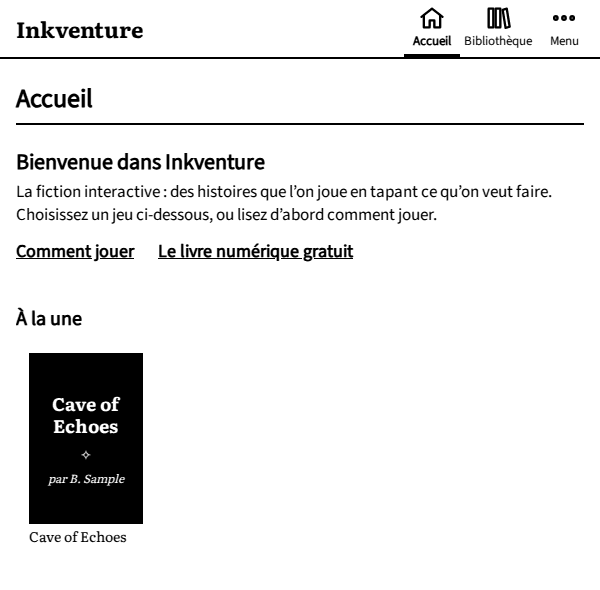
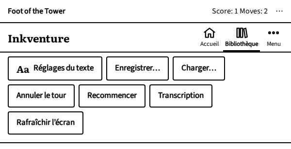
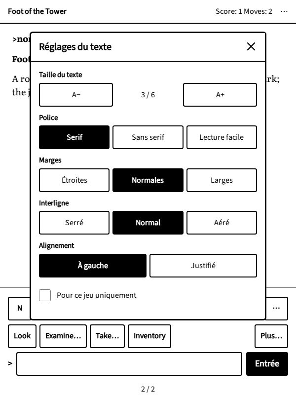

# Inkventure sur votre liseuse

## Ouvrir l'application

1. Activez le Wi-Fi.
2. Ouvrez le navigateur web. Sur certaines liseuses, il est dans le menu principal, parfois parmi les fonctions
   « expérimentales ».
3. Allez à l'adresse <{{host}}>. Ajoutez-la aux favoris du navigateur pour la retrouver d'un geste.

Les liens de ce livre font de même : suivez-en un, confirmez l'ouverture de la page web, et l'application s'ouvre sur
ce jeu. Sur un appareil sans navigateur, ou pour envoyer un jeu à un ami, scannez le code QR de la fiche avec un
téléphone.

Le Wi-Fi sert à ouvrir l'application et à télécharger un jeu. Une fois le jeu ouvert, il continue de fonctionner
même si la connexion tombe.

## Trouver un jeu

L'application s'ouvre sur l'**Accueil** : le jeu en cours, avec un bouton **Continuer**, vos aventures, et une
sélection de jeux pour commencer.

{.screenshot}

La **Bibliothèque** contient tout le catalogue : cherchez par titre ou par auteur, et affinez la liste avec les
**Filtres** (genre, langue, durée, note…). Le filtre et le badge **Pour commencer** signalent les jeux indulgents
avec les débutants. Touchez un jeu pour voir sa page : une présentation, sa durée et sa note, un bouton **Jouer**, et
**Ajouter à l'accueil** pour le garder pour plus tard. Quelques jeux existent en plusieurs langues, chacune avec son
fichier : leur page permet de choisir.

## Dans le lecteur

L'histoire est mise en pages, comme un livre. Touchez la droite de l'écran pour tourner la page, la gauche pour
revenir en arrière. Les nombres en bas (« 2 / 3 ») indiquent la page où vous êtes. Les boutons et le champ de
commande sont sur la dernière page, avec la dernière réponse ; depuis une page précédente, **Retour au présent** vous
y ramène.

Touchez la ligne en haut de la page (le lieu où vous êtes, le score) pour ouvrir le menu :

{.screenshot}

- **Accueil** et **Bibliothèque**, pour quitter le jeu (il est sauvegardé).
- **Aa Réglages du texte** : taille du texte, police (dont *Lecture facile*, plus espacée), marges, interligne et
  alignement, pour tous les jeux ou pour ce jeu uniquement.
- **Enregistrer…**, **Charger…**, **Annuler le tour**, **Recommencer**.
- **Transcription** : tout ce qui s'est passé depuis le début, à relire.
- **Rafraîchir l'écran** : l'encre électronique garde une légère trace des pages précédentes ; ce bouton redessine
  la page proprement.

{.screenshot}

## Où sont gardées vos parties

Votre progression, vos parties enregistrées et vos réglages sont gardés dans le navigateur web de la liseuse, sur
l'appareil même. Il n'y a pas de compte : rien n'est envoyé nulle part, et personne d'autre ne voit à quoi vous
jouez.

Cela a deux conséquences :

- Vos parties restent sur cette liseuse. Sur un autre appareil, vous recommencez.
- Effacer les données du navigateur (cookies, données des sites ou historique, selon la liseuse) les efface, tout
  comme **Tout effacer** dans les Réglages de l'application.

Le navigateur accorde quelques mégaoctets à l'application. **Réglages › Données et stockage** indique la place
utilisée. Quand elle vient à manquer, l'application oublie d'abord les fichiers de jeu téléchargés (ils seront
téléchargés de nouveau au besoin), puis les vieilles sauvegardes automatiques des jeux délaissés depuis des mois.
Elle ne supprime jamais sans vous prévenir une partie que vous avez enregistrée vous-même.
